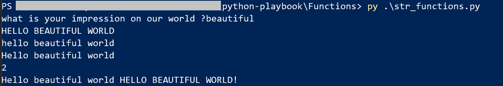
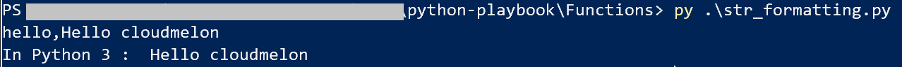
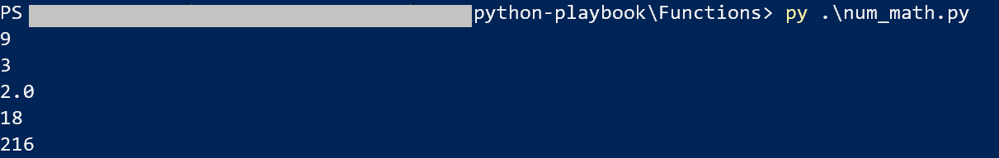
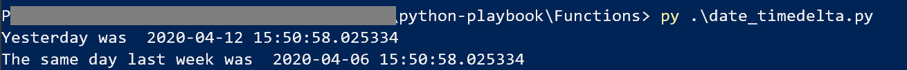

# Play 2 String formatting functions

This play introduces the formatting and functions in Python

## Single quotes or double quotes ? 

In general you can use single quote it works perfectly !

```
print('hello wonderful world')
```
At some point, you'll need to use double quote such as the following when the string itself contains a single quote: 

```
print("It's a small world after all")
```
## modify the strings 
The following functions you can use to modify the strings :

```
sample_input = input('what is your impression on our world ?')
sample_str = 'Hello ' + sample_input +' world'

print(sample_str.upper())
print(sample_str.lower())
print(sample_str.capitalize())
print(sample_str.count('o'))

print(sample_str + ' ' \
    + sample_str.upper() + '!')

```

The sample output will look like the following : 




## Formatting the strings

Putting in place holders with curly braces 

```
your_greetings = 'Hello'
your_name = 'cloudmelon'

str_output = 'hello,{0} {1}'.format(your_greetings, your_name)

# Below is only working in Python 3
str_output_py3 = f'{your_greetings} {your_name}'

print(str_output)
print('In Python 3 : ', str_output_py3)

```

The sample output will look like the following : 




## Playing with numbers 

You can use the variables the define numbers of your choice, you'll need to play with math with numbers,  you can use the following operators : 
- Addition (+)
- Subtraction (-)
- Multiplication (*)
- Division(/)
- Exponent (**) such as 7 to the power of 3 = 73 = 343 ( To stick with 7 to the power of 3 as an example, insert 7 for the base and enter 3 as the index, also known as exponent or power.) 

You can use such things as follows :

```
num_1 = 6
num_2 = 3


# Time to play with math :)
print(num_1 + num_2) 
print(num_1 - num_2) 
print(num_1 / num_2)
print(num_1 * num_2)
print(num_1 ** num_2)

```

Expecting the output would be as the following : 



## Playing with BOTH string and numbers 

In this case, Python is getting confused sometimes, so you need to tell them exactly what data types in your program, this is where conversion comes in, the previous program could be improved as the following : 

```
num_1 = int(input('Input your 1st number : '))
num_2 = int(input('Input your 2nd number : '))


# Time to play with math :)
print ('Addition is ')
print (num_1 + num_2) 

print('Subtraction is ' ) 
print(num_1 - num_2)

print('Division is ' )
print(num_1/num_2)

print('Multiplication is ' )
print(num_1*num_2)

print('Exponent is ' )
print(num_1**num_2)


```

Expecting the output would be as the following : 


## Play with date data types

This is widely used in logging or saving data creation or modification time :

```
# Import the libraries
from datetime import datetime

current_date = datetime.now()

print(current_date)
print('Now is ', str(current_date))
print('Day: ' + str(current_date.day))
print('Month: ' + str(current_date.month))
print('Year : ' + str(current_date.year))

```

## use timedelta to define a period of time 

```
from datetime import datetime, timedelta

current_date = datetime.now()


one_day = timedelta(days=1)
one_week = timedelta(weeks=1)

yday = current_date - one_day
the_same_date_last_week = current_date - one_week

print('Yesterday was ', str(yday))
print('The same day last week was ', str(the_same_date_last_week))
```

Expecting the output would be as the following : 


To know more about datetime please check documentation :  https://docs.python.org/3/library/datetime.html

## strftime vs strptime 

strptime is short for "parse time" where strftime is for "formatting time".

```
# Import the libraries
from datetime import datetime
current_date = datetime.now()

# convert to a date time object
date_for_today = datetime.strftime(current_date,'%d/%m/%y')
print("Today's date is : " + str(date_for_today))

```


## Functions 

You can define a function use **def** key words, such as you might usually do in other programming language :


```
def call_function():
    print('hello functions !')


def params_function(sample_param):
    print(sample_param)

def multiparams_function(sample_param, function_name='default function'):
    print(sample_param, function_name)

call_function()
params_function('hello param function !')
multiparams_function('hello multiparams ', 'hello function !')

print('call multiparams function again')
multiparams_function('hello multiparams ')

```

Expecting the output would be as the following : 


## Modules

A module is a python file with functions, classes and other components. It is designed to break code down into individual reusable structured pieces. 


