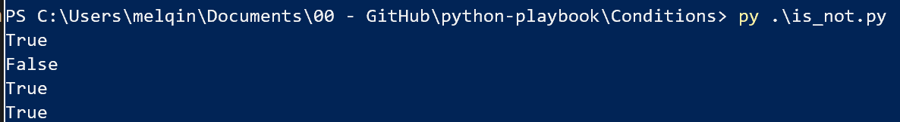

# Play 3 Conditions 

Conditions usually used to handle simple to complex business rules. This play is majorly for various conditions and operators. 

## If Else and operators

All comparison operators (==, !=, >, <, >=, <=) are available. It could be used with logical operators ( and, or, not)

### Single condition : 

```
num = float(input('What is your number of donated toys ?'))

if num >= 2.00:
    note = .07   #number 4 spaces, can also written as note = 0.07
  
else:
    note = 0
print(note)
```


### mutiple condition :

```
# Input a number
num = float(input('What is your number of donated toys ?'))

if num < 1.00:
    note = .02   #number 4 spaces, can also written as note = 0.07

# Use and, or in this condition or not(number<=1.0 and x>5)
# elif number >=1 or num < 5    
elif num >= 1.00 and num < 5:
    note = .07 
elif num >= 5:
    note = 0.9
else :
    note = 0
print(note)
```

### Comparaison 

Note that when use '==' to compare strings, remember it is **case sensitive** . Also identity operators ( **is** and **is not**), you can use as the following :

```
note1 = ["num1", "num2"]
note2 = ["num2", "num3"]
note3 = note1

print(note1 is not note2)

print(note2 is note3)

print(note3 is note1)
```

Expecting the output would be as the following : 


And membership operators (**in** and **not in**)

```
note1 = ["num1", "num2"]
note2 = ["num2", "num3"]

print('num1' in note1)
print('num3' in note1)
print('num1' not in note2)
```

Expecting the output would be as the following : 


