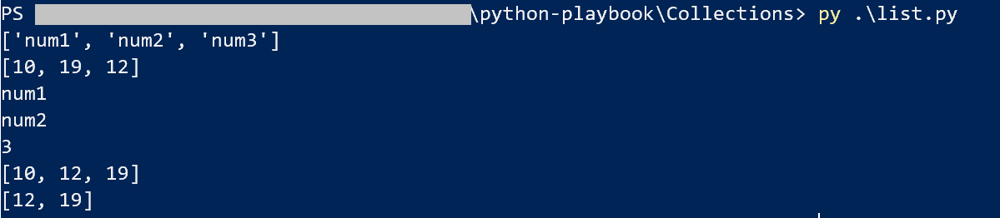
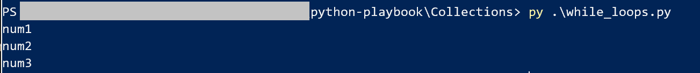

# Collections and loop

This play is mainly explainning how to use conditions and loop expressions.

## List and Arrays
We have already explained in conditions about collections, now is just digging into it deeper. List of items makes a collection.

Difference : 
- **Lists** stores any types of items with storage order guaranteed.
- **Array** stores numerical data types and must all be the same data type.

```
Use the list 

note1 = ["num1", "num2", "num3"]
note2 = []

note2.append(19)
note2.append(12)
note2.insert(0,10)

print(note1)
print(note2)
print(note1[0])
print(note1[1])

print(len(note1))

note2.sort()
print(note2)

# if you wanna a sub-collection

note3 = note2[1:3] # or note2[:3]
print(note3)
```

Expecting the output would be as the following : 



## Dictionary

A dictionary is a key value pair, and order of storage is not guaranteed. 

```
note = {'math': 16}  # with curly brace

note['Philo'] = 18  # with brackets
print(note)
print(note['math'])

```

Expecting the output would be as the following : 


## Loops

Just as we learned from other programming languages :

- **For** expression

```
notes = ["num1", "num2", "num3"]

for note in notes:
    print (note)


# x number of times

for inx in range(0,10):
    print(inx)
```

Expecting the output would be as the following : 


- **while** expression

```
notes = ["num1", "num2", "num3"]

inx = 0

while inx < len(notes):
    print (notes[inx])
    inx = inx + 1 
```

Expecting the output would be as the following : 
